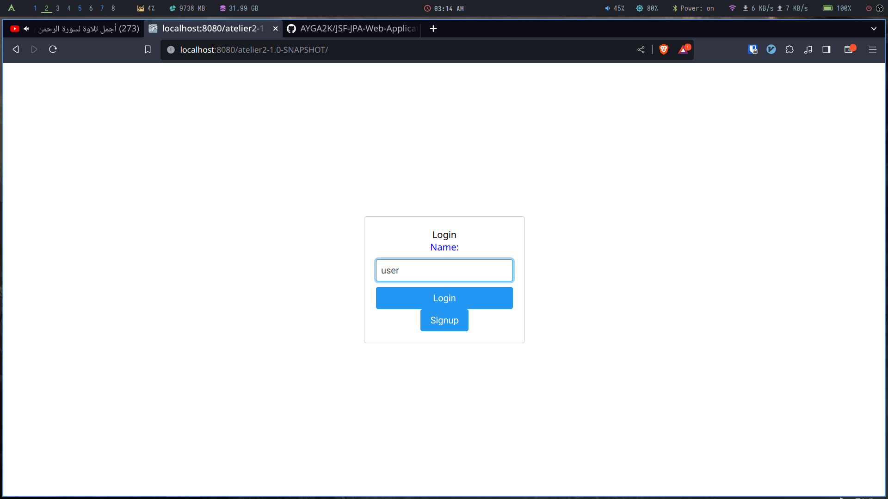
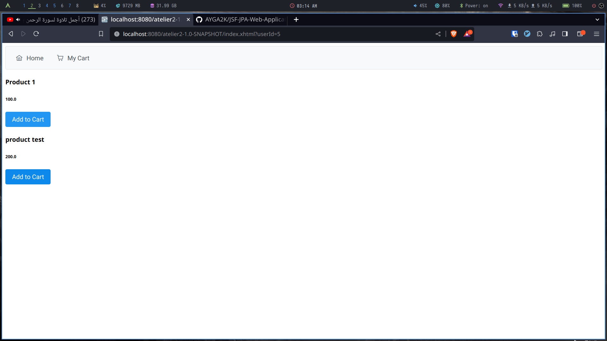
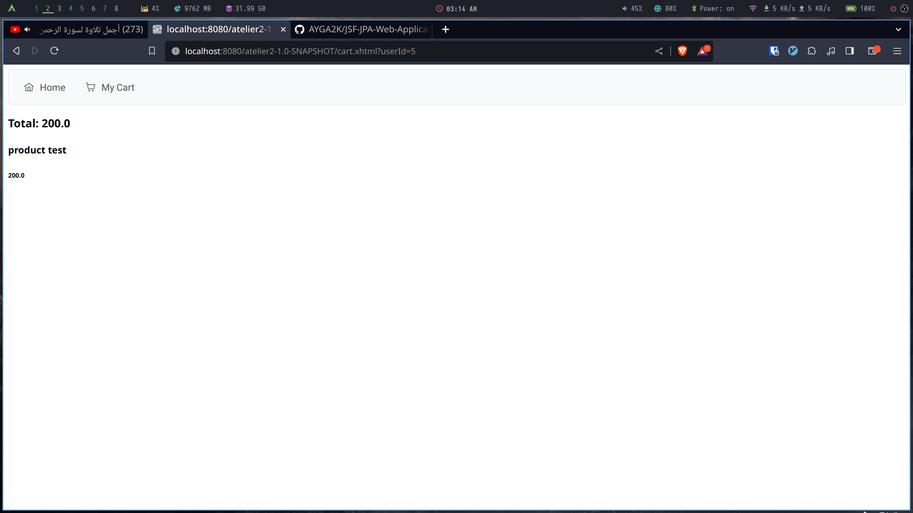
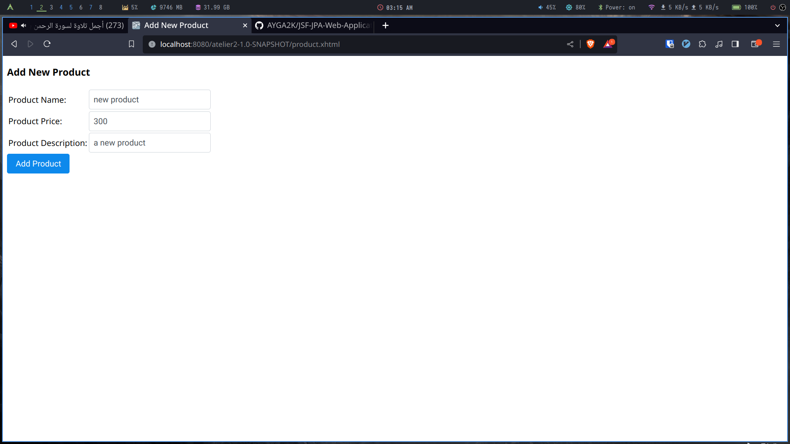
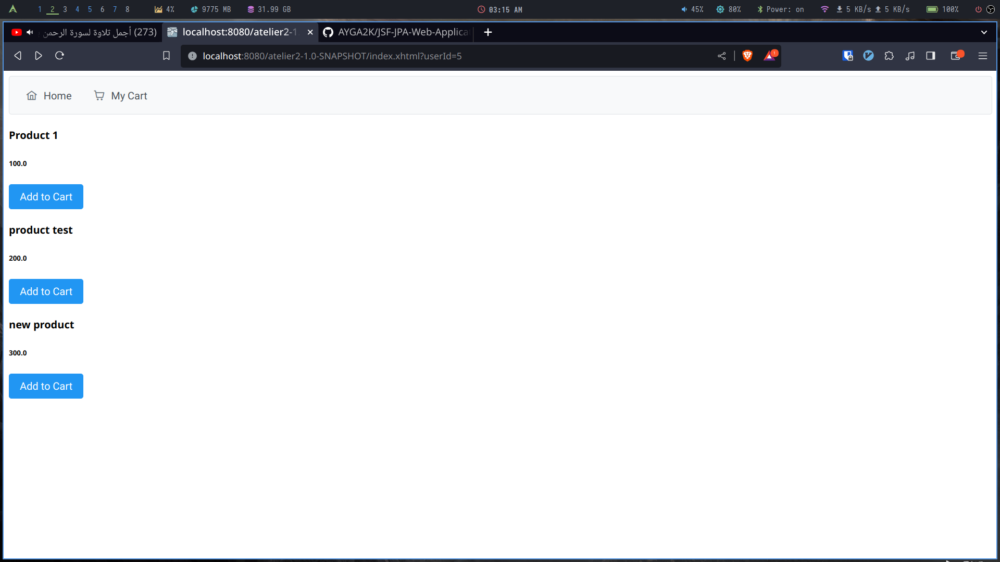
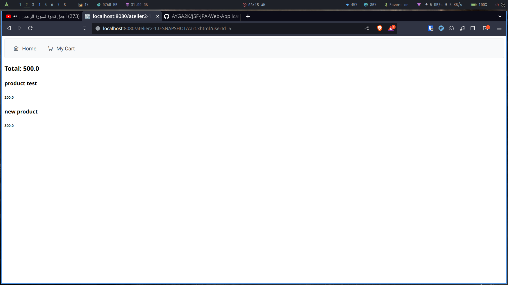

# Web application based on JSF and JPA

<!--toc:start-->

- [Class Diagram](#class-diagram) - [Cart Class](#cart-class) - [Product Class](#product-class) - [Storefront Class](#storefront-class) - [User Class](#user-class)
<!--toc:end-->

## Class Diagram

### Cart Class

- **Attributes**:
  - products: List of products added to the cart
  - total: The total amount of the cart
- **Methods**:
  - CRUD

### Product Class

- **Attributes**:
  - name: The name of the product
  - price: The price of the product
  - description: The product description
  - image: The product image
- **Methods**:
  - CRUD

### Storefront Class

- **Attributes**:
  - name: The name of the storefront
  - availableProducts: List of products available in the storefront
- **Methods**:
  - CRUD

### User Class

- **Attributes**:
  - name: The name of the user
  - address: The user's address
  - cart: The user's shopping cart
- **Methods**:
  - CRUD

## Screens

